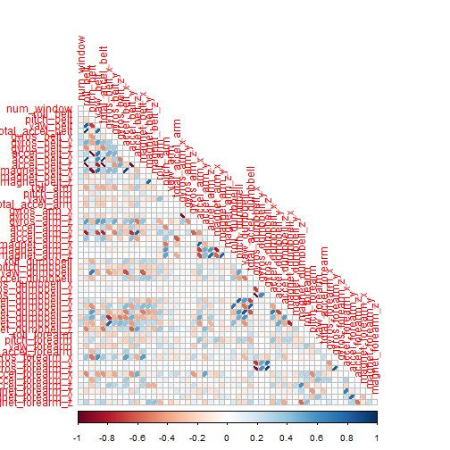
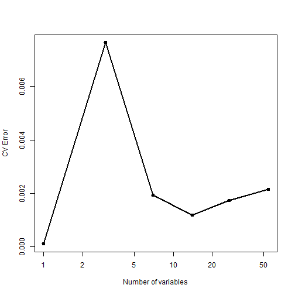

# Predicting Exercises

## Executive Summary

Using devices such as *Jawbone Up*, *Nike FuelBand*, and *Fitbit* it is now possible to collect a large amount of data about personal activity relatively inexpensively. 6 participants were asked to perform barbell lifts correctly and incorrectly in 5 different ways. The goal of this project is to predict the manner in which they did the exercise based on analysis of the data collected.

## Exploratory Data Analysis

Analyzing the loaded data with summary command, we find there are many blanks in addition to NA, hence reloaded converting blanks to NA. We want to exclude data attributes that have too many NA compared to real values. Also, the timestamp and user_name variables can be excluded from the analysis.


```r
# load data ensuring blanks are converted to NA
training<-read.csv("C:/coursera/predictivemachinelearning/pml-training.csv", header=TRUE, na.strings=c("NA", ""))
testing<-read.csv("C:/coursera/predictivemachinelearning/pml-testing.csv", header=TRUE, na.strings=c("NA", ""))
countOfNA<-sapply(training, function(x) sum(is.na(x)))
# remove attributes that have too many NA
training.1<-training[,!names(training) %in% names(countOfNA[countOfNA>0])]
testing.1<-testing[,!names(testing) %in% names(countOfNA[countOfNA>0])]
# remove user_name and timestamp 
training.1<-training.1[,-c(1:5)]
testing.1<-testing.1[,-c(1:5)]
```
Let us check if there is any correlation between the different remaining 55 attributes. This will allow us to determine if principal component analysis will be helpful with the model that we are creating.


```r
cor.matrix<-cor(training.1[,-c(1,55)]) # compute correlations
diag(cor.matrix)<-0
which(cor.matrix>0.8, arr.ind=T)     # results not displayed
```
Appendix Figure 1 shows the correlation matrix graphically. We find there are 22 attributes with correlation > 0.8 indicating PCA will be helpful.

## Building the Model

Let us attempt a Random Forest model with principal component analysis, with classe as the result and rest of the attributes as predictors.


```r
# random forest with principal component analysis
modelFit<-train(classe~., method="rf", preProcess="pca", data=training.1)
```


```r
modelFit
```

```
## Random Forest 
## 
## 19622 samples
##    54 predictor
##     5 classes: 'A', 'B', 'C', 'D', 'E' 
## 
## Pre-processing: principal component signal extraction, scaled, centered 
## Resampling: Bootstrapped (25 reps) 
## 
## Summary of sample sizes: 19622, 19622, 19622, 19622, 19622, 19622, ... 
## 
## Resampling results across tuning parameters:
## 
##   mtry  Accuracy  Kappa  Accuracy SD  Kappa SD
##    2    1         1      0.002        0.002   
##   28    1         1      0.006        0.008   
##   54    1         1      0.006        0.008   
## 
## Accuracy was used to select the optimal model using  the largest value.
## The final value used for the model was mtry = 2.
```

```r
# check model prediction results against the training set itself
confusionMatrix(training.1$classe, predict(modelFit,training.1))
```

```
## Confusion Matrix and Statistics
## 
##           Reference
## Prediction    A    B    C    D    E
##          A 5580    0    0    0    0
##          B    0 3797    0    0    0
##          C    0    0 3422    0    0
##          D    0    0    0 3216    0
##          E    0    0    0    0 3607
## 
## Overall Statistics
##                                 
##                Accuracy : 1     
##                  95% CI : (1, 1)
##     No Information Rate : 0.284 
##     P-Value [Acc > NIR] : <2e-16
##                                 
##                   Kappa : 1     
##  Mcnemar's Test P-Value : NA    
## 
## Statistics by Class:
## 
##                      Class: A Class: B Class: C Class: D Class: E
## Sensitivity             1.000    1.000    1.000    1.000    1.000
## Specificity             1.000    1.000    1.000    1.000    1.000
## Pos Pred Value          1.000    1.000    1.000    1.000    1.000
## Neg Pred Value          1.000    1.000    1.000    1.000    1.000
## Prevalence              0.284    0.194    0.174    0.164    0.184
## Detection Rate          0.284    0.194    0.174    0.164    0.184
## Detection Prevalence    0.284    0.194    0.174    0.164    0.184
## Balanced Accuracy       1.000    1.000    1.000    1.000    1.000
```
Let us check the cross-validated performance of models with sequentially reduced number of predictors using the rfcv function and the results are plotted in Appendix Figure 2.


```r
rf.cv<-rfcv(training.1[,-55], training.1[,55])
```
Finally, let us predict the classe variable for the testing set:


```r
# predict against the testing set
predict(modelFit,testing.1)
```

```
##  [1] B A A A A E D B A A B C B A E E A B B B
## Levels: A B C D E
```

## Summary

We created a model using Random Forest method with the training dataset provided and predicted the manner in which the exercise was one for the testing set. Th ersults obtained from the above model for the testing set proved to be accurate as suggested by the grades in the project submission.

## Appendix

### Figure 1. Correlation matrix plot

```r
corrplot(cor.matrix, method="ellipse", type="lower")
```

 

### Figure 2. Random Forest Cross Validation plot

```r
with(rf.cv, plot(n.var, error.cv, log="x", type="o", lwd=2, xlab="Number of variables", ylab="CV Error"))
```

 

